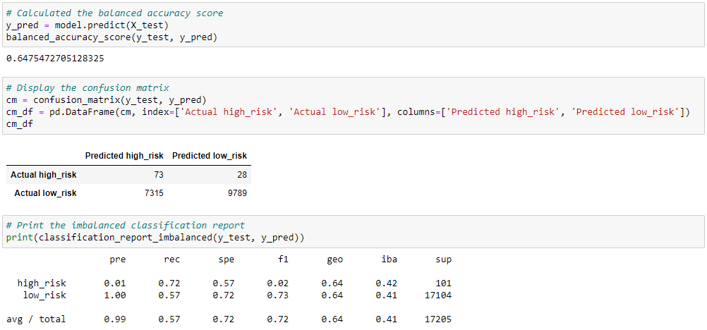

# Automating Loan Approvals

## Overview:
Utilize various Machine Learning Models to analyze the credit worthiness of loan applicants.

The performance of following six Machine Learning Models are evaluated based on three scores:
1. Balanced Accuracy Score simply tells us the fraction of predictions that the model predicted correctly.
2. Precision Score (a.k.a. Predictive Value) is the fraction of 'true positives' divided by all 'predicted positives'. A high Precision score is more important when we are more worried about false positives.
3. Recall (a.k.a Sensitivity) Score tells us the fraction of 'true positives' divided by all 'actual positives'. A high Recall score is more important when we are more worried about false negatives.

## Results:

### Naive Random Oversampling
- Accuracy score: 64.1%
- Precision score: 1% for predicting high_risk vs 100% for predicting low_risk applications
- Recall score: 72% for predicting high_risk vs 56% for predicting low_risk

### Synthetic Minority Oversampling Technique (SMOTE)
- Accuracy score: 65.9%
- Precision score: 1% for predicting high_risk vs 100% for predicting low_risk aplications
- Recall score: 62% for predicting high_risk vs 69% for predicting low_risk applications

### Cluster Centroids Undersampling
- Accuracy score: 54.4%
- Precision score: 1% for predicting high_risk vs 100% for predicting low_risk aplications
- Recall score: 69% for predicting high_risk vs 40% for predicting low_risk applications

### Combination (Over & Under) Sampling
- Accuracy score: 64.8%
- Precision score: 1% for predicting high_risk vs 100% for predicting low_risk aplications
- Recall score: 72% for predicting high_risk vs 57% for predicting low_risk applications

### Balanced Random Forest Classifier
- Accuracy score: 78.9%
- Precision score: 3% for predicting high_risk vs 100% for predicting low_risk aplications
- Recall score: 70% for predicting high_risk vs 87% for predicting low_risk applications

### Easy Ensemble AdaBoost Classifier
- Accuracy score: 91.5%
- Precision score: 5% for predicting high_risk vs 100% for predicting low_risk aplications
- Recall score: 93% for predicting high_risk vs 90% for predicting low_risk applications

## Summary:
The high-risk loan applications inherently represent a smaller proportion of the total population, thus creating a class imbalance that needs to be overcome. The models utilized above each attempt to overcome this imbalance in a different way. Upon reviewing the results, the Easy Ensemble AdaBoost Classifier appears to perform best when it comes to predicting high vs low risk loan applications. The accuracy score is highest (at 91.5%) and the recall scores are both > 90%. While the precision score for predicting high-risk loan applications is low, at 5%, it is still higher than that of the other models (with the Balanced Random Forest Classifier model scoring 3%, and all other models scoring 1%). Therefore, our recommendation is to use the Easy Ensemble AdaBoost Classifier as a reference when assessing the credit-worthiness of customers.

# Tools
1. Python (Jupyter Notebook)
    - scikit-learn 
    - imbalanced-learn
    - RandomOverSampler
    - SMOTE (Synthetic Minority Oversampling Technique)
    - ClusterCentroids (Undersampling)
    - SMOTEENN (Combination Sampling)
    - BalancedRandomForestClassifier
    - EasyEnsembleClassifier (AdaBoost classifier)